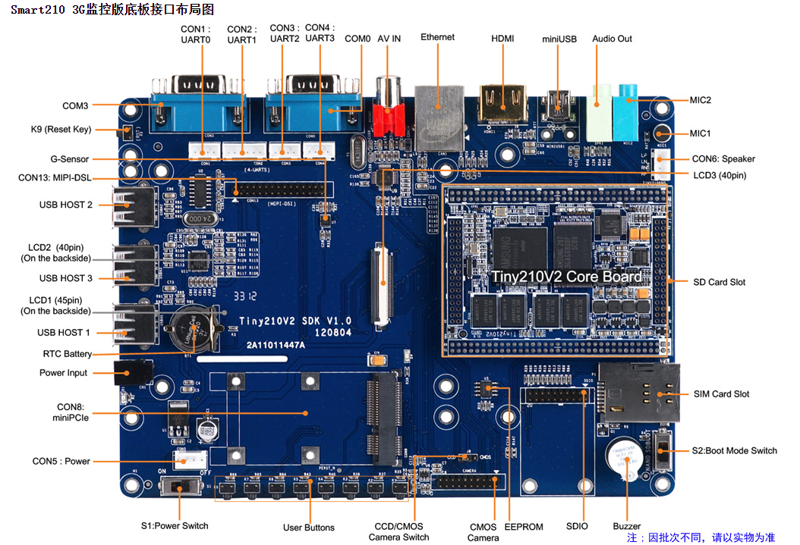
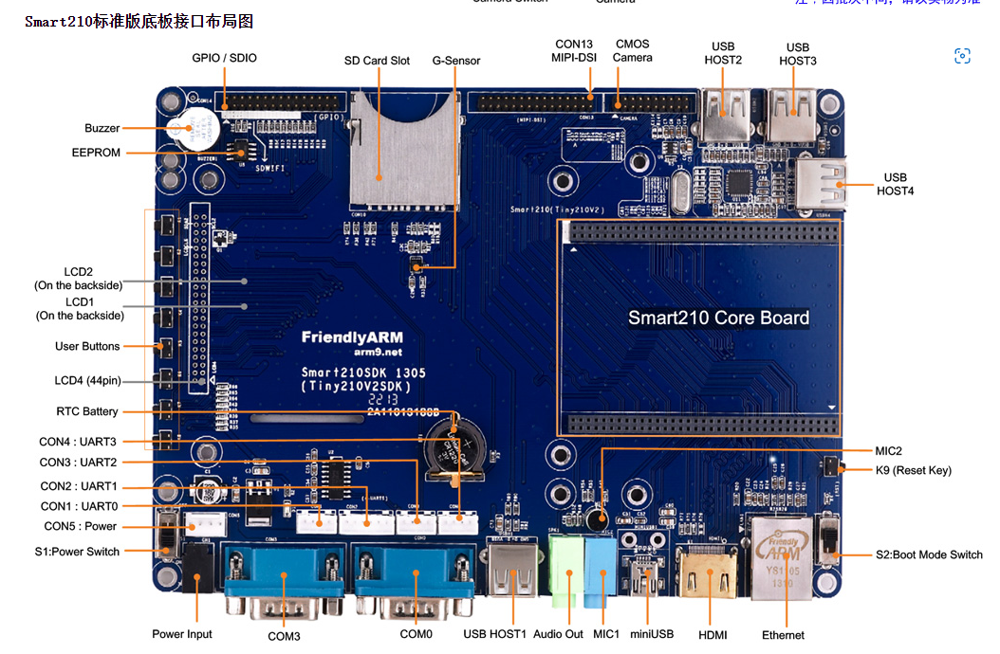
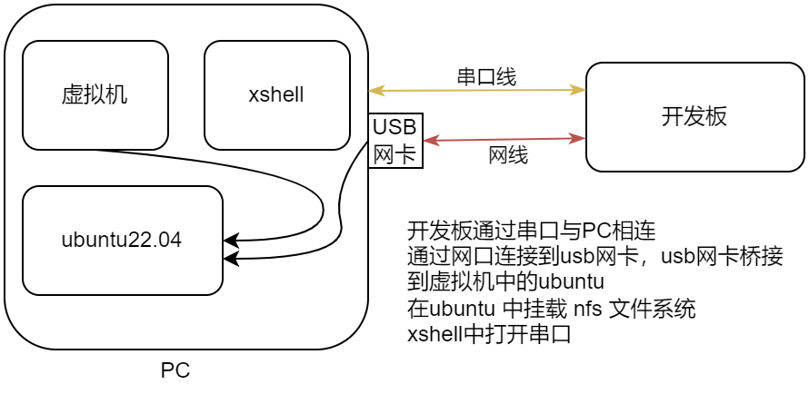
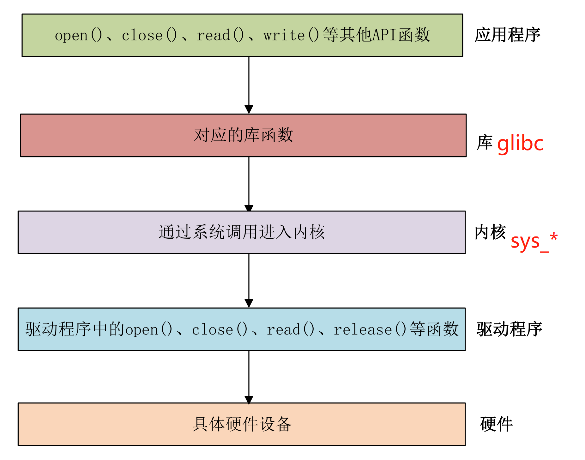

[toc] 


# SMART210 开发板

### 开发板配置






具体查看 [友善电子官网](http://www.friendlyelec.com.cn/Smart210.asp)

## 本机环境

PC环境：Win10 + Vmware 16.10 

虚拟机：ubuntu22.04 lts，arm-buildroot-linux-gnueabi-gcc.br_real (Buildroot 2022.02) 11.2.0

板子环境：[u-boot2014.4](https://github.com/Gonglja/u-boot-smart210) + [Linux 5.19 rc4](https://github.com/Gonglja/linux) + buildroot 构建的 rootfs

**注意编译linux、rootfs、linux-driver使用的交叉编译工具链需保持一致！！！**

**不然会产生各种错误，比如core dump**

连接方式：


具体vmware安装虚拟机，请参考[Archlinux从安装到使用（持续更新中）](https://gonglja.github.io/posts/d78cdbc6/#安装)

NFS配置，参考[ubuntu21.04及以上开启nfs(包括v2支持)](https://gonglja.github.io/posts/b176ed63/)


## 基础知识

### linux-driver

#### 系统是如何从用户态 read 调用到自定义驱动的read 函数的



```c
/* 因为是用户程序，read 不能直接调用内核中的 sys_read，因此通过调用 glibc 中的__libc_read 来发出swi 中断请求，中断请求被系统捕获，然后才会执行 sys_read
/ 调用的是 glibc 中的 __libc_read(sysdeps/unix/sysv/linux/read.c)
*/
//----------------------------------------------------------------------------------------------------------
ssize_t
__libc_read (int fd, void *buf, size_t nbytes)
{
  return SYSCALL_CANCEL (read, fd, buf, nbytes);
}

//----------------------------------------------------------------------------------------------------------
#define SYSCALL_CANCEL(...) \
  ({									     \
    long int sc_ret;							     \
    if (NO_SYSCALL_CANCEL_CHECKING)					     \
      sc_ret = INLINE_SYSCALL_CALL (__VA_ARGS__); 			     \
    else								     \
      {									     \
	int sc_cancel_oldtype = LIBC_CANCEL_ASYNC ();			     \
	sc_ret = INLINE_SYSCALL_CALL (__VA_ARGS__);			     \
        LIBC_CANCEL_RESET (sc_cancel_oldtype);				     \
      }									     \
    sc_ret;								     \
  })
// 由于 NO_SYSCALL_CANCEL_CHECKING 默认为 0，所以此处会走else分支，然后操作就是加锁，同步等
// 接着调用 INLINE_SYSCALL_CALL(__VA_ARGS__)
    
//----------------------------------------------------------------------------------------------------------
#define INLINE_SYSCALL_CALL(...) \
  __INLINE_SYSCALL_DISP (__INLINE_SYSCALL, __VA_ARGS__)
// 此处 __INLINE_SYSCALL_DISP 实际上就是 #define __SYSCALL_CONCAT_X(a,b)     a##b，将第一个参数通过 ## 连接起来，
//   相当于有1个参数的话，就调用 
#define __INLINE_SYSCALL1(name, a1) \
  INLINE_SYSCALL (name, 1, a1)
// 有3个参数的话，就调用
#define __INLINE_SYSCALL3(name, a1, a2, a3) \
  INLINE_SYSCALL (name, 3, a1, a2, a3)

// 不管有几个参数，最终调用的都是
INLINE_SYSCALL
   
// INLINE_SYSCALL 在arm下被定义为 INTERNAL_SYSCALL_RAW
#undef INTERNAL_SYSCALL
#define INTERNAL_SYSCALL(name, nr, args...)			\
	INTERNAL_SYSCALL_RAW(SYS_ify(name), nr, args)

// 接着在看 下INTERNAL_SYSCALL_RAW，这个地方才是最终实现，最终调用一个 swi 中断（software interrupt）
// 通过软中断向内核发送一个明确的请求，内核将调用内核相关函数来实现（如sys_read等）
# undef INTERNAL_SYSCALL_RAW
# define INTERNAL_SYSCALL_RAW(name, nr, args...)		\
  ({								\
       register int _a1 asm ("r0"), _nr asm ("r7");		\
       LOAD_ARGS_##nr (args)					\
       _nr = name;						\
       asm volatile ("swi	0x0	@ syscall " #name	\
		     : "=r" (_a1)				\
		     : "r" (_nr) ASM_ARGS_##nr			\
		     : "memory");				\
       _a1; })
    
// 之后就进入到了内核态 下的 sys_read
```


接着内核态的 sys_read 通过参数

内核是怎么启动的？大体框架如下，详见 [内核启动流程](https://blog.csdn.net/perfect1t/article/details/81741531)

```c
ENTRY(stext)----------------------------------------------------------------------------- arch/arm/kernel/vmlinux.lds.S
    |
    --> ENTRY(stext) ----------------------------------------------------------------------arch/arm/kernel/head.S
    	 |
    	 ...
    	 |
    	 --> __mmap_switched----------------------------------------------------------arch/arm/kernel/head.S
    		 |
    		 --> b start_kernel--------------------------------------------------------- arch/arm/kernel/head-common.S
    			 |
    			 --> start_kernel ---------------------------------------------------- init/main.c
```


#### pinctrl 子系统

设置 PIN 的复用和电气属性

查看 linuxer 大佬的 [Linux内核中的GPIO子系统](https://ixnh5t4bny.feishu.cn/docs/doccnDyLMNSEByIxAuz0GSYJ5He)


#### gpio 子系统

看 [pinctrl 子系统](#pinctrl 子系统)


#### 设备树

详见 [设备树](https://gonglja.github.io/posts/9faa78d2/)

在设备树中，常会有如下格式，需要注意的是 在label中不能有 `-`，否则会编译报错。

`label: node-name@unit-address`


#### API

##### module_init & module_exit

位于`#include <linux/module.h>`

可以看到，如果未定义宏`MODULE`，则直接编译到内核里面，否则编成模块。

```c
#ifndef MODULE

#define module_init(x)	__initcall(x);
#define module_exit(x)	__exitcall(x);

#else /* MODULE */
...
/* Each module must use one module_init(). */
#define module_init(initfn)					\
	static inline initcall_t __maybe_unused __inittest(void)		\
	{ return initfn; }					\
	int init_module(void) __copy(initfn)			\
		__attribute__((alias(#initfn)));		\
	__CFI_ADDRESSABLE(init_module, __initdata);

/* This is only required if you want to be unloadable. */
#define module_exit(exitfn)					\
	static inline exitcall_t __maybe_unused __exittest(void)		\
	{ return exitfn; }					\
	void cleanup_module(void) __copy(exitfn)		\
		__attribute__((alias(#exitfn)));		\
	__CFI_ADDRESSABLE(cleanup_module, __exitdata);

#endif
   
```


###### #ifndef MODULE

```c
#define module_init(x)  __initcall(x);
|
--> #define __initcall(fn) device_initcall(fn)
    |
    --> #define device_initcall(fn)     __define_initcall(fn, 6)
        |
        --> #define __define_initcall(fn, id) \
                static initcall_t __initcall_##fn##id __used \
                __attribute__((__section__(".initcall" #id ".init"))) = fn
```

即 `module_init(hello_init)` 展开为

```c
static initcall_t  __initcall_hello_init6 \
    __used   __attribute__((__section__(".initcall6.init"))) = hello_init
```

这里的意思就是：定义一个名为 `__initcall_hello_init6` 的函数指针变量，并初始化为 `hello_init`（指向`hello_init`）；并且该函数指针变量存放于 `.initcall6.init`代码段中。


###### #else

```c
#define module_init(initfn)                 \
    static inline initcall_t __inittest(void)       \
    { return initfn; }                  \
    int init_module(void) __attribute__((alias(#initfn)));
```

**__inittest** 仅仅是为了检测定义的函数是否符合 **initcall_t** 类型，如果不是 __inittest 类型在编译时将会报错。

所以真正的宏定义是：

```c
#define module_init(initfn)                 \
    int init_module(void) __attribute__((alias(#initfn)));
```

**alias** 属性是`gcc`的特有属性，将定义`init_module`为函数`initfn`的别名。所以`module_init(hello_init)` 的作用就是定义一个变量名 **init_module**，其地址和 **hello_init** 是一样的。

详见[module_init机制的理解](https://blog.csdn.net/weixin_37571125/article/details/78665184)


##### file_operations

位于`#include <linux/fs.h>`

**`file_operations`是一个对设备进行操作的抽象结构体**。linux内核为设备建立一个设备文件，这样就使得对设备文件的所有操作，就相当于对设备的操作。用户程序可以用访问普通文件的方法访问设备文件，进而访问设备。

对普通文件的访问，常常使用open(), write(), read(), close(), ioctl()等方法。同样，对设备文件的访问，也可以使用这些方法。于是，对设备驱动的编写，就编程了对不同操作函数的编写。

详见[file_operations 结构体知识解析](https://blog.csdn.net/zqixiao_09/article/details/50850475)


##### printk

printk在内核来记录日志的函数，使用方法类似printf，但不能输出浮点数。

主要做两件事情

- 将信息记录到log中
- 将日志输出到控制台

详见 [printk函数的用法](https://blog.csdn.net/zqixiao_09/article/details/50850475)


##### ioremap & iounmap

位于 `#include <asm/io.h>`

ioremap 映射经MMU转换的物理地址

iounmap 取消映射

详见[ioremap 函数概念](https://www.cnblogs.com/ggzhangxiaochao/p/12893777.html)


##### writel/writeb & readl/readb等

往/从内存映射的`I/O`空间写/读数据

`writex`可拆为`write`和 `x`，`write`表示写，`read`表示读

`x`表示想要写的数据长度。

- b - 1字节（8位）
- w - 2字节（16位）

- l - 4字节（32位）

详见[readb(), readw(), readl()，writeb(), writew(), writel() 宏函数](https://blog.csdn.net/hustyangju/article/details/20448339)


##### copy_from/to_user

位置 `#include <linux/uaccess.h>`

`copy_from_user` 从用户空间拷贝数据到内核空间，成功返回0，失败返回没有被拷贝的字节数

`copy_to_user`   从内核空间拷贝数据到用户空间，成功返回0，失败返回没有被拷贝的字节数

详见 [copy_from_user分析](https://www.cnblogs.com/rongpmcu/p/7662749.html)


##### register_chrdev_region

```c
/*指定设备编号来静态注册一个字符设备
	from:  注册的指定起始设备编号,比如:MKDEV(100, 0),表示起始主设备号100, 起始次设备号为0
	count: 需要连续注册的次设备编号个数,比如: 起始次设备号为0,count=100,表示0~99的次设备号都要绑定在同一个file_operations操作方法结构体上
	*name: 字符设备名称
     当返回值小于0,表示注册失败
*/
int register_chrdev_region(dev_t from, unsigned count, const char *name);　　

/*动态分配一个字符设备,注册成功并将分配到的主次设备号放入*dev里
	*dev: 存放起始设备编号的指针,当注册成功, *dev就会等于分配到的起始设备编号,可以通过MAJOR()和MINNOR()函数来提取主次设备号
	baseminor:次设备号基地址,也就是起始次设备号
	count:需要连续注册的次设备编号个数,比如: 起始次设备号(baseminor)为0,baseminor=2,表示0~1的此设备号都要绑定在同一个file_operations操作方法结构体上
	*name:字符设备名称
    当返回值小于0,表示注册失败
*/
int alloc_chrdev_region(dev_t *dev, unsigned baseminor, unsigned count,const char *name);
```

详见[29.使用register_chrdev_region()系列来注册字符设备](https://www.cnblogs.com/lifexy/p/7827559.html)


##### unregister_chrdev_region

```c
 /*注销字符设备
 	from: 注销的指定起始设备编号,比如:MKDEV(100, 0),表示起始主设备号100, 起始次设备号为0
       count:需要连续注销的次设备编号个数,比如: 起始次设备号为0,baseminor=100,表示注销掉0~99的次设备号
 */
void unregister_chrdev_region(dev_t from, unsigned count);
```


##### cdev

```c
struct cdev {
       struct kobject    kobj;         		        // 内嵌的kobject对象 
       struct module   *owner;               	  // 所属模块
       const struct file_operations  *ops;       // 操作方法结构体
       struct list_head  list;      　　　　　　 // 与 cdev 对应的字符设备文件的 inode->i_devices 的链表头
       dev_t dev;      　　　　　　　　　　 // 起始设备编号,可以通过MAJOR(),MINOR()来提取主次设备号
       unsigned int count;              　　        // 连续注册的次设备号个数
};

 /*初始化cdev结构体,并将file_operations结构体放入cdev-> ops 里*/
void cdev_init(struct cdev *cdev, const struct file_operations *fops);

/*将cdev结构体添加到系统中,并将dev(注册好的设备编号)放入cdev-> dev里,  count(次设备编号个数)放入cdev->count里*/
int cdev_add(struct cdev *p, dev_t dev, unsigned count);

/*将系统中的cdev结构体删除掉*/
void cdev_del(struct cdev *p);
```


##### class

详见[Linux 内核：设备驱动模型（3）class与device](https://www.cnblogs.com/schips/p/linux_device_model_3.html)


##### device

使用register_chrdev函数注册字符设备的时候，只需要一个主设备号即可，但这样可能会带来两个问题

- 需要事先准备查看哪些主设备号没有使用
- 另一个就是会将主设备下的所有次设备号全部用掉，太浪费次设备号。

那么怎么解决该问题呢？就是使用设备号的时候向linux申请，用几个申请几个。

如果未给定设备号

使用`int alloc_chrdev_region(dev_t *dev, unsigned baseminor, unsigned count, const char *name)`来申请设备号

如果给定主设备号和次设备号，使用

`int register_chrdev_region(dev_t from, unsigned count, const char *name)`来注册，参数from是要注册的设备号，count申请的个数，一般1个，name设备名字。

使用以上两个注册设备后，统一使用释放函数`void unregister_chrdev_region(dev_t from, unsigned count)`


## 构建

### u-boot 构建

```bash
#!/bin/bash

## ubuntu 22.04 lts
## 0.1 Install corss-compile-toochain
# 

## 0.2 Dep
# sudo apt install lib32ncurses6
# sudo apt install lib32z1


export CROSS_COMPILE=/opt/FriendlyARM/toolschain/4.5.1/bin/arm-none-linux-gnueabi-
export ARCH=arm

make clean && make distclean
make smart210_config
make -j$(nproc)

```

[u-boot 2014.4 源码分析](https://gonglja.github.io/posts/f88e6d17/)


### linux 构建

```bash
#!/bin/bash

## ubuntu 22.04 lts kernel 最新版本
## 0.1 Install corss-compile-toochain
# sudo apt install gcc-arm-none-eabi

## 0.2 Dep
# sudo apt install flex bison
# sudo apt-get install libssl-dev
# sudo apt install u-boot-tools 
# sudo apt-get install libgmp-dev libmpc-dev

## 0.3 issue
# fdt error
# sudo apt-get purge -y --auto-remove libfdt-dev

# 0.4 配置编译链环境
export ARCH=arm
export CROSS_COMPILE=/opt/s5pv210/arm-buildroot-linux-gnueabi_sdk-buildroot/bin/arm-buildroot-linux-gnueabi-

OUT_DIR=/home/u/workspace/os/output

# 0.5  清除以前编译
make clean 
make distclean
make mrproper
mkdir -p $OUT_DIR


# 1.0 配置s5pv210默认配置，指定输出位置
make s5pv210_fin_defconfig O=$OUT_DIR

# 1.1 编译 uImage
make LOADADDR=0x20004000 uImage O=$OUT_DIR -j$(nproc)

# 1.2 编译 modules 并安装至./output下
make modules O=$OUT_DIR -j$(nproc)
make INSTALL_MOD_PATH=$OUT_DIR/res O=$OUT_DIR modules_install 

# 1.3 编译 dtbs 并安装至./output下
make dtbs  O=$OUT_DIR -j$(nproc)
make INSTALL_DTBS_PATH=$OUT_DIR/res O=$OUT_DIR dtbs_install


# echo "copy to ../rootfs/"
# sudo cp -vrf $(OUT_DIR)/arch/arm/boot/uImage rootfs/
# sudo cp -vrf $(OUT_DIR)/arch/arm/boot/dts/s5pv210-smart210.dtb rootfs/
```


### buildroot 构建

#### 构建帮助

`make help`


#### 构建编译链

详细配置 [参考](#参考) 2

`make sdk -j12`


#### 构建rootfs

`make -j12`


## [linux-driver](https://github.com/Gonglja/linux-driver)


### char


pinctrl

通过在 s5pv210.dtsi中可找到 `pinctrl0`，其中`compatible`属性的值为`samsung,s5pv210-pinctrl`，在代码中全局搜索找一下，发现有如下代码

```c
		pinctrl0: pinctrl@e0200000 {
			compatible = "samsung,s5pv210-pinctrl";
			reg = <0xe0200000 0x1000>;
			interrupt-parent = <&vic0>;
			interrupts = <30>;

			wakeup-interrupt-controller {
				compatible = "samsung,s5pv210-wakeup-eint";
				interrupts = <16>;
				interrupt-parent = <&vic0>;
			};
		};

/***********************************************************************************/
// dirvers/pinctrl/samsung/pinctrl-samsung.c
static const struct of_device_id samsung_pinctrl_dt_match[] = {
#ifdef CONFIG_PINCTRL_EXYNOS_ARM
	...
	{ .compatible = "samsung,s5pv210-pinctrl",
		.data = &s5pv210_of_data },
#endif
...
static struct platform_driver samsung_pinctrl_driver = {
	.probe		= samsung_pinctrl_probe,
	.driver = {
		.name	= "samsung-pinctrl",
		.of_match_table = samsung_pinctrl_dt_match,
		.suppress_bind_attrs = true,
		.pm = &samsung_pinctrl_pm_ops,
	},
};
    
/**
  在这里只需要了解到 platform_driver 是平台设备驱动，当 platform_driver 中的设置与驱动匹配成功后，就会执行 probe 函数，在这里是            samsung_pinctrl_probe，接着整个调用逻辑如下：
*/
samsung_pinctrl_probe
    |
    --> samsung_pinctrl_probe
    	|
    	--> samsung_pinctrl_register
    		|
    		--> samsung_pinctrl_parse_dt
    			devm_pinctrl_register
    			|
    			--> pinctrl_register				
    				|
    				--> pinctrl_init_controller		-- 注册所有的pin 对应以下日志。
  
```

只有当设备树中的compatible与`platform_driver`中的`of_device_id`中的compatible匹配成功，则可以使用

```c
[    0.101525][    T1] pinctrl core: initialized pinctrl subsystem
[    0.101801][    T1] reg-dummy reg-dummy: no of_node; not parsing pinctrl DT
[    0.105999][    T1] samsung_pinctrl_drv_register
[    0.115211][    T1] samsung-pinctrl e0200000.pinctrl: try to register 237 pins ...
[    0.115238][    T1] pinctrl core: registered pin 0 (gpa0-0) on samsung-pinctrl
[    0.115252][    T1] pinctrl core: registered pin 1 (gpa0-1) on samsung-pinctrl
[    0.115260][    T1] pinctrl core: registered pin 2 (gpa0-2) on samsung-pinctrl
[    0.115266][    T1] pinctrl core: registered pin 3 (gpa0-3) on samsung-pinctrl
[    0.115273][    T1] pinctrl core: registered pin 4 (gpa0-4) on samsung-pinctrl
[    0.115278][    T1] pinctrl core: registered pin 5 (gpa0-5) on samsung-pinctrl
[    0.115284][    T1] pinctrl core: registered pin 6 (gpa0-6) on samsung-pinctrl
[    0.115289][    T1] pinctrl core: registered pin 7 (gpa0-7) on samsung-pinctrl
[    0.115295][    T1] pinctrl core: registered pin 8 (gpa1-0) on samsung-pinctrl
[    0.115301][    T1] pinctrl core: registered pin 9 (gpa1-1) on samsung-pinctrl
[    0.115306][    T1] pinctrl core: registered pin 10 (gpa1-2) on samsung-pinctrl
[    0.115313][    T1] pinctrl core: registered pin 11 (gpa1-3) on samsung-pinctrl
[    0.115319][    T1] pinctrl core: registered pin 12 (gpb-0) on samsung-pinctrl
[    0.115325][    T1] pinctrl core: registered pin 13 (gpb-1) on samsung-pinctrl
[    0.115331][    T1] pinctrl core: registered pin 14 (gpb-2) on samsung-pinctrl
[    0.115337][    T1] pinctrl core: registered pin 15 (gpb-3) on samsung-pinctrl
[    0.115342][    T1] pinctrl core: registered pin 16 (gpb-4) on samsung-pinctrl
[    0.115348][    T1] pinctrl core: registered pin 17 (gpb-5) on samsung-pinctrl
[    0.115354][    T1] pinctrl core: registered pin 18 (gpb-6) on samsung-pinctrl
[    0.115360][    T1] pinctrl core: registered pin 19 (gpb-7) on samsung-pinctrl
[    0.115366][    T1] pinctrl core: registered pin 20 (gpc0-0) on samsung-pinctrl
[    0.115372][    T1] pinctrl core: registered pin 21 (gpc0-1) on samsung-pinctrl
[    0.115377][    T1] pinctrl core: registered pin 22 (gpc0-2) on samsung-pinctrl
[    0.115383][    T1] pinctrl core: registered pin 23 (gpc0-3) on samsung-pinctrl
[    0.115389][    T1] pinctrl core: registered pin 24 (gpc0-4) on samsung-pinctrl
[    0.115395][    T1] pinctrl core: registered pin 25 (gpc1-0) on samsung-pinctrl
[    0.115401][    T1] pinctrl core: registered pin 26 (gpc1-1) on samsung-pinctrl
[    0.115407][    T1] pinctrl core: registered pin 27 (gpc1-2) on samsung-pinctrl
[    0.115412][    T1] pinctrl core: registered pin 28 (gpc1-3) on samsung-pinctrl
[    0.115418][    T1] pinctrl core: registered pin 29 (gpc1-4) on samsung-pinctrl
[    0.115430][    T1] pinctrl core: registered pin 30 (gpd0-0) on samsung-pinctrl
[    0.115437][    T1] pinctrl core: registered pin 31 (gpd0-1) on samsung-pinctrl
[    0.115443][    T1] pinctrl core: registered pin 32 (gpd0-2) on samsung-pinctrl
[    0.115449][    T1] pinctrl core: registered pin 33 (gpd0-3) on samsung-pinctrl
[    0.115455][    T1] pinctrl core: registered pin 34 (gpd1-0) on samsung-pinctrl
[    0.115461][    T1] pinctrl core: registered pin 35 (gpd1-1) on samsung-pinctrl
[    0.115467][    T1] pinctrl core: registered pin 36 (gpd1-2) on samsung-pinctrl
[    0.115473][    T1] pinctrl core: registered pin 37 (gpd1-3) on samsung-pinctrl
[    0.115479][    T1] pinctrl core: registered pin 38 (gpd1-4) on samsung-pinctrl
[    0.115485][    T1] pinctrl core: registered pin 39 (gpd1-5) on samsung-pinctrl
[    0.115491][    T1] pinctrl core: registered pin 40 (gpe0-0) on samsung-pinctrl
[    0.115498][    T1] pinctrl core: registered pin 41 (gpe0-1) on samsung-pinctrl
[    0.115503][    T1] pinctrl core: registered pin 42 (gpe0-2) on samsung-pinctrl
[    0.115509][    T1] pinctrl core: registered pin 43 (gpe0-3) on samsung-pinctrl
[    0.115515][    T1] pinctrl core: registered pin 44 (gpe0-4) on samsung-pinctrl
[    0.115521][    T1] pinctrl core: registered pin 45 (gpe0-5) on samsung-pinctrl
[    0.115527][    T1] pinctrl core: registered pin 46 (gpe0-6) on samsung-pinctrl
[    0.115533][    T1] pinctrl core: registered pin 47 (gpe0-7) on samsung-pinctrl
[    0.115539][    T1] pinctrl core: registered pin 48 (gpe1-0) on samsung-pinctrl
[    0.115545][    T1] pinctrl core: registered pin 49 (gpe1-1) on samsung-pinctrl
[    0.115550][    T1] pinctrl core: registered pin 50 (gpe1-2) on samsung-pinctrl
[    0.115556][    T1] pinctrl core: registered pin 51 (gpe1-3) on samsung-pinctrl
[    0.115562][    T1] pinctrl core: registered pin 52 (gpe1-4) on samsung-pinctrl
[    0.115568][    T1] pinctrl core: registered pin 53 (gpf0-0) on samsung-pinctrl
[    0.115574][    T1] pinctrl core: registered pin 54 (gpf0-1) on samsung-pinctrl
[    0.115580][    T1] pinctrl core: registered pin 55 (gpf0-2) on samsung-pinctrl
[    0.115586][    T1] pinctrl core: registered pin 56 (gpf0-3) on samsung-pinctrl
[    0.115591][    T1] pinctrl core: registered pin 57 (gpf0-4) on samsung-pinctrl
[    0.115597][    T1] pinctrl core: registered pin 58 (gpf0-5) on samsung-pinctrl
[    0.115603][    T1] pinctrl core: registered pin 59 (gpf0-6) on samsung-pinctrl
[    0.115609][    T1] pinctrl core: registered pin 60 (gpf0-7) on samsung-pinctrl
[    0.115615][    T1] pinctrl core: registered pin 61 (gpf1-0) on samsung-pinctrl
[    0.115621][    T1] pinctrl core: registered pin 62 (gpf1-1) on samsung-pinctrl
[    0.115627][    T1] pinctrl core: registered pin 63 (gpf1-2) on samsung-pinctrl
[    0.115635][    T1] pinctrl core: registered pin 64 (gpf1-3) on samsung-pinctrl
[    0.115641][    T1] pinctrl core: registered pin 65 (gpf1-4) on samsung-pinctrl
[    0.115647][    T1] pinctrl core: registered pin 66 (gpf1-5) on samsung-pinctrl
[    0.115653][    T1] pinctrl core: registered pin 67 (gpf1-6) on samsung-pinctrl
[    0.115659][    T1] pinctrl core: registered pin 68 (gpf1-7) on samsung-pinctrl
[    0.115665][    T1] pinctrl core: registered pin 69 (gpf2-0) on samsung-pinctrl
[    0.115671][    T1] pinctrl core: registered pin 70 (gpf2-1) on samsung-pinctrl
[    0.115677][    T1] pinctrl core: registered pin 71 (gpf2-2) on samsung-pinctrl
[    0.115683][    T1] pinctrl core: registered pin 72 (gpf2-3) on samsung-pinctrl
[    0.115689][    T1] pinctrl core: registered pin 73 (gpf2-4) on samsung-pinctrl
[    0.115695][    T1] pinctrl core: registered pin 74 (gpf2-5) on samsung-pinctrl
[    0.115701][    T1] pinctrl core: registered pin 75 (gpf2-6) on samsung-pinctrl
[    0.115707][    T1] pinctrl core: registered pin 76 (gpf2-7) on samsung-pinctrl
[    0.115713][    T1] pinctrl core: registered pin 77 (gpf3-0) on samsung-pinctrl
[    0.115719][    T1] pinctrl core: registered pin 78 (gpf3-1) on samsung-pinctrl
[    0.115725][    T1] pinctrl core: registered pin 79 (gpf3-2) on samsung-pinctrl
[    0.115731][    T1] pinctrl core: registered pin 80 (gpf3-3) on samsung-pinctrl
[    0.115737][    T1] pinctrl core: registered pin 81 (gpf3-4) on samsung-pinctrl
[    0.115743][    T1] pinctrl core: registered pin 82 (gpf3-5) on samsung-pinctrl
[    0.115749][    T1] pinctrl core: registered pin 83 (gpg0-0) on samsung-pinctrl
[    0.115755][    T1] pinctrl core: registered pin 84 (gpg0-1) on samsung-pinctrl
[    0.115761][    T1] pinctrl core: registered pin 85 (gpg0-2) on samsung-pinctrl
[    0.115767][    T1] pinctrl core: registered pin 86 (gpg0-3) on samsung-pinctrl
[    0.115773][    T1] pinctrl core: registered pin 87 (gpg0-4) on samsung-pinctrl
[    0.115779][    T1] pinctrl core: registered pin 88 (gpg0-5) on samsung-pinctrl
[    0.115784][    T1] pinctrl core: registered pin 89 (gpg0-6) on samsung-pinctrl
[    0.115790][    T1] pinctrl core: registered pin 90 (gpg1-0) on samsung-pinctrl
[    0.115796][    T1] pinctrl core: registered pin 91 (gpg1-1) on samsung-pinctrl
[    0.115802][    T1] pinctrl core: registered pin 92 (gpg1-2) on samsung-pinctrl
[    0.115808][    T1] pinctrl core: registered pin 93 (gpg1-3) on samsung-pinctrl
[    0.115818][    T1] pinctrl core: registered pin 94 (gpg1-4) on samsung-pinctrl
[    0.115825][    T1] pinctrl core: registered pin 95 (gpg1-5) on samsung-pinctrl
[    0.115831][    T1] pinctrl core: registered pin 96 (gpg1-6) on samsung-pinctrl
[    0.115837][    T1] pinctrl core: registered pin 97 (gpg2-0) on samsung-pinctrl
[    0.115843][    T1] pinctrl core: registered pin 98 (gpg2-1) on samsung-pinctrl
[    0.115849][    T1] pinctrl core: registered pin 99 (gpg2-2) on samsung-pinctrl
[    0.115855][    T1] pinctrl core: registered pin 100 (gpg2-3) on samsung-pinctrl
[    0.115861][    T1] pinctrl core: registered pin 101 (gpg2-4) on samsung-pinctrl
[    0.115867][    T1] pinctrl core: registered pin 102 (gpg2-5) on samsung-pinctrl
[    0.115873][    T1] pinctrl core: registered pin 103 (gpg2-6) on samsung-pinctrl
[    0.115879][    T1] pinctrl core: registered pin 104 (gpg3-0) on samsung-pinctrl
[    0.115885][    T1] pinctrl core: registered pin 105 (gpg3-1) on samsung-pinctrl
[    0.115891][    T1] pinctrl core: registered pin 106 (gpg3-2) on samsung-pinctrl
[    0.115897][    T1] pinctrl core: registered pin 107 (gpg3-3) on samsung-pinctrl
[    0.115903][    T1] pinctrl core: registered pin 108 (gpg3-4) on samsung-pinctrl
[    0.115909][    T1] pinctrl core: registered pin 109 (gpg3-5) on samsung-pinctrl
[    0.115915][    T1] pinctrl core: registered pin 110 (gpg3-6) on samsung-pinctrl
[    0.115921][    T1] pinctrl core: registered pin 111 (gpj0-0) on samsung-pinctrl
[    0.115927][    T1] pinctrl core: registered pin 112 (gpj0-1) on samsung-pinctrl
[    0.115933][    T1] pinctrl core: registered pin 113 (gpj0-2) on samsung-pinctrl
[    0.115939][    T1] pinctrl core: registered pin 114 (gpj0-3) on samsung-pinctrl
[    0.115945][    T1] pinctrl core: registered pin 115 (gpj0-4) on samsung-pinctrl
[    0.115951][    T1] pinctrl core: registered pin 116 (gpj0-5) on samsung-pinctrl
[    0.115957][    T1] pinctrl core: registered pin 117 (gpj0-6) on samsung-pinctrl
[    0.115963][    T1] pinctrl core: registered pin 118 (gpj0-7) on samsung-pinctrl
[    0.115969][    T1] pinctrl core: registered pin 119 (gpj1-0) on samsung-pinctrl
[    0.115975][    T1] pinctrl core: registered pin 120 (gpj1-1) on samsung-pinctrl
[    0.115981][    T1] pinctrl core: registered pin 121 (gpj1-2) on samsung-pinctrl
[    0.115987][    T1] pinctrl core: registered pin 122 (gpj1-3) on samsung-pinctrl
[    0.115993][    T1] pinctrl core: registered pin 123 (gpj1-4) on samsung-pinctrl
[    0.115999][    T1] pinctrl core: registered pin 124 (gpj1-5) on samsung-pinctrl
[    0.116005][    T1] pinctrl core: registered pin 125 (gpj2-0) on samsung-pinctrl
[    0.116011][    T1] pinctrl core: registered pin 126 (gpj2-1) on samsung-pinctrl
[    0.116017][    T1] pinctrl core: registered pin 127 (gpj2-2) on samsung-pinctrl
[    0.116024][    T1] pinctrl core: registered pin 128 (gpj2-3) on samsung-pinctrl
[    0.116030][    T1] pinctrl core: registered pin 129 (gpj2-4) on samsung-pinctrl
[    0.116036][    T1] pinctrl core: registered pin 130 (gpj2-5) on samsung-pinctrl
[    0.116042][    T1] pinctrl core: registered pin 131 (gpj2-6) on samsung-pinctrl
[    0.116048][    T1] pinctrl core: registered pin 132 (gpj2-7) on samsung-pinctrl
[    0.116054][    T1] pinctrl core: registered pin 133 (gpj3-0) on samsung-pinctrl
[    0.116060][    T1] pinctrl core: registered pin 134 (gpj3-1) on samsung-pinctrl
[    0.116066][    T1] pinctrl core: registered pin 135 (gpj3-2) on samsung-pinctrl
[    0.116072][    T1] pinctrl core: registered pin 136 (gpj3-3) on samsung-pinctrl
[    0.116078][    T1] pinctrl core: registered pin 137 (gpj3-4) on samsung-pinctrl
[    0.116084][    T1] pinctrl core: registered pin 138 (gpj3-5) on samsung-pinctrl
[    0.116090][    T1] pinctrl core: registered pin 139 (gpj3-6) on samsung-pinctrl
[    0.116096][    T1] pinctrl core: registered pin 140 (gpj3-7) on samsung-pinctrl
[    0.116102][    T1] pinctrl core: registered pin 141 (gpj4-0) on samsung-pinctrl
[    0.116108][    T1] pinctrl core: registered pin 142 (gpj4-1) on samsung-pinctrl
[    0.116114][    T1] pinctrl core: registered pin 143 (gpj4-2) on samsung-pinctrl
[    0.116120][    T1] pinctrl core: registered pin 144 (gpj4-3) on samsung-pinctrl
[    0.116126][    T1] pinctrl core: registered pin 145 (gpj4-4) on samsung-pinctrl
[    0.116132][    T1] pinctrl core: registered pin 146 (gpi-0) on samsung-pinctrl
[    0.116138][    T1] pinctrl core: registered pin 147 (gpi-1) on samsung-pinctrl
[    0.116144][    T1] pinctrl core: registered pin 148 (gpi-2) on samsung-pinctrl
[    0.116150][    T1] pinctrl core: registered pin 149 (gpi-3) on samsung-pinctrl
[    0.116156][    T1] pinctrl core: registered pin 150 (gpi-4) on samsung-pinctrl
[    0.116161][    T1] pinctrl core: registered pin 151 (gpi-5) on samsung-pinctrl
[    0.116167][    T1] pinctrl core: registered pin 152 (gpi-6) on samsung-pinctrl
[    0.116173][    T1] pinctrl core: registered pin 153 (mp01-0) on samsung-pinctrl
[    0.116180][    T1] pinctrl core: registered pin 154 (mp01-1) on samsung-pinctrl
[    0.116186][    T1] pinctrl core: registered pin 155 (mp01-2) on samsung-pinctrl
[    0.116192][    T1] pinctrl core: registered pin 156 (mp01-3) on samsung-pinctrl
[    0.116198][    T1] pinctrl core: registered pin 157 (mp01-4) on samsung-pinctrl
[    0.116207][    T1] pinctrl core: registered pin 158 (mp01-5) on samsung-pinctrl
[    0.116214][    T1] pinctrl core: registered pin 159 (mp01-6) on samsung-pinctrl
[    0.116220][    T1] pinctrl core: registered pin 160 (mp01-7) on samsung-pinctrl
[    0.116226][    T1] pinctrl core: registered pin 161 (mp02-0) on samsung-pinctrl
[    0.116232][    T1] pinctrl core: registered pin 162 (mp02-1) on samsung-pinctrl
[    0.116238][    T1] pinctrl core: registered pin 163 (mp02-2) on samsung-pinctrl
[    0.116244][    T1] pinctrl core: registered pin 164 (mp02-3) on samsung-pinctrl
[    0.116250][    T1] pinctrl core: registered pin 165 (mp03-0) on samsung-pinctrl
[    0.116256][    T1] pinctrl core: registered pin 166 (mp03-1) on samsung-pinctrl
[    0.116262][    T1] pinctrl core: registered pin 167 (mp03-2) on samsung-pinctrl
[    0.116268][    T1] pinctrl core: registered pin 168 (mp03-3) on samsung-pinctrl
[    0.116274][    T1] pinctrl core: registered pin 169 (mp03-4) on samsung-pinctrl
[    0.116280][    T1] pinctrl core: registered pin 170 (mp03-5) on samsung-pinctrl
[    0.116286][    T1] pinctrl core: registered pin 171 (mp03-6) on samsung-pinctrl
[    0.116292][    T1] pinctrl core: registered pin 172 (mp03-7) on samsung-pinctrl
[    0.116298][    T1] pinctrl core: registered pin 173 (mp04-0) on samsung-pinctrl
[    0.116304][    T1] pinctrl core: registered pin 174 (mp04-1) on samsung-pinctrl
[    0.116310][    T1] pinctrl core: registered pin 175 (mp04-2) on samsung-pinctrl
[    0.116316][    T1] pinctrl core: registered pin 176 (mp04-3) on samsung-pinctrl
[    0.116322][    T1] pinctrl core: registered pin 177 (mp04-4) on samsung-pinctrl
[    0.116328][    T1] pinctrl core: registered pin 178 (mp04-5) on samsung-pinctrl
[    0.116335][    T1] pinctrl core: registered pin 179 (mp04-6) on samsung-pinctrl
[    0.116341][    T1] pinctrl core: registered pin 180 (mp04-7) on samsung-pinctrl
[    0.116347][    T1] pinctrl core: registered pin 181 (mp05-0) on samsung-pinctrl
[    0.116353][    T1] pinctrl core: registered pin 182 (mp05-1) on samsung-pinctrl
[    0.116358][    T1] pinctrl core: registered pin 183 (mp05-2) on samsung-pinctrl
[    0.116365][    T1] pinctrl core: registered pin 184 (mp05-3) on samsung-pinctrl
[    0.116371][    T1] pinctrl core: registered pin 185 (mp05-4) on samsung-pinctrl
[    0.116377][    T1] pinctrl core: registered pin 186 (mp05-5) on samsung-pinctrl
[    0.116383][    T1] pinctrl core: registered pin 187 (mp05-6) on samsung-pinctrl
[    0.116388][    T1] pinctrl core: registered pin 188 (mp05-7) on samsung-pinctrl
[    0.116394][    T1] pinctrl core: registered pin 189 (mp06-0) on samsung-pinctrl
[    0.116401][    T1] pinctrl core: registered pin 190 (mp06-1) on samsung-pinctrl
[    0.116407][    T1] pinctrl core: registered pin 191 (mp06-2) on samsung-pinctrl
[    0.116415][    T1] pinctrl core: registered pin 192 (mp06-3) on samsung-pinctrl
[    0.116421][    T1] pinctrl core: registered pin 193 (mp06-4) on samsung-pinctrl
[    0.116427][    T1] pinctrl core: registered pin 194 (mp06-5) on samsung-pinctrl
[    0.116434][    T1] pinctrl core: registered pin 195 (mp06-6) on samsung-pinctrl
[    0.116440][    T1] pinctrl core: registered pin 196 (mp06-7) on samsung-pinctrl
[    0.116446][    T1] pinctrl core: registered pin 197 (mp07-0) on samsung-pinctrl
[    0.116452][    T1] pinctrl core: registered pin 198 (mp07-1) on samsung-pinctrl
[    0.116458][    T1] pinctrl core: registered pin 199 (mp07-2) on samsung-pinctrl
[    0.116464][    T1] pinctrl core: registered pin 200 (mp07-3) on samsung-pinctrl
[    0.116470][    T1] pinctrl core: registered pin 201 (mp07-4) on samsung-pinctrl
[    0.116476][    T1] pinctrl core: registered pin 202 (mp07-5) on samsung-pinctrl
[    0.116482][    T1] pinctrl core: registered pin 203 (mp07-6) on samsung-pinctrl
[    0.116488][    T1] pinctrl core: registered pin 204 (mp07-7) on samsung-pinctrl
[    0.116493][    T1] pinctrl core: registered pin 205 (gph0-0) on samsung-pinctrl
[    0.116499][    T1] pinctrl core: registered pin 206 (gph0-1) on samsung-pinctrl
[    0.116505][    T1] pinctrl core: registered pin 207 (gph0-2) on samsung-pinctrl
[    0.116511][    T1] pinctrl core: registered pin 208 (gph0-3) on samsung-pinctrl
[    0.116517][    T1] pinctrl core: registered pin 209 (gph0-4) on samsung-pinctrl
[    0.116523][    T1] pinctrl core: registered pin 210 (gph0-5) on samsung-pinctrl
[    0.116529][    T1] pinctrl core: registered pin 211 (gph0-6) on samsung-pinctrl
[    0.116535][    T1] pinctrl core: registered pin 212 (gph0-7) on samsung-pinctrl
[    0.116541][    T1] pinctrl core: registered pin 213 (gph1-0) on samsung-pinctrl
[    0.116548][    T1] pinctrl core: registered pin 214 (gph1-1) on samsung-pinctrl
[    0.116554][    T1] pinctrl core: registered pin 215 (gph1-2) on samsung-pinctrl
[    0.116560][    T1] pinctrl core: registered pin 216 (gph1-3) on samsung-pinctrl
[    0.116565][    T1] pinctrl core: registered pin 217 (gph1-4) on samsung-pinctrl
[    0.116572][    T1] pinctrl core: registered pin 218 (gph1-5) on samsung-pinctrl
[    0.116577][    T1] pinctrl core: registered pin 219 (gph1-6) on samsung-pinctrl
[    0.116583][    T1] pinctrl core: registered pin 220 (gph1-7) on samsung-pinctrl
[    0.116589][    T1] pinctrl core: registered pin 221 (gph2-0) on samsung-pinctrl
[    0.116601][    T1] pinctrl core: registered pin 222 (gph2-1) on samsung-pinctrl
[    0.116607][    T1] pinctrl core: registered pin 223 (gph2-2) on samsung-pinctrl
[    0.116613][    T1] pinctrl core: registered pin 224 (gph2-3) on samsung-pinctrl
[    0.116619][    T1] pinctrl core: registered pin 225 (gph2-4) on samsung-pinctrl
[    0.116625][    T1] pinctrl core: registered pin 226 (gph2-5) on samsung-pinctrl
[    0.116631][    T1] pinctrl core: registered pin 227 (gph2-6) on samsung-pinctrl
[    0.116637][    T1] pinctrl core: registered pin 228 (gph2-7) on samsung-pinctrl
[    0.116643][    T1] pinctrl core: registered pin 229 (gph3-0) on samsung-pinctrl
[    0.116649][    T1] pinctrl core: registered pin 230 (gph3-1) on samsung-pinctrl
[    0.116656][    T1] pinctrl core: registered pin 231 (gph3-2) on samsung-pinctrl
[    0.116662][    T1] pinctrl core: registered pin 232 (gph3-3) on samsung-pinctrl
[    0.116668][    T1] pinctrl core: registered pin 233 (gph3-4) on samsung-pinctrl
[    0.116674][    T1] pinctrl core: registered pin 234 (gph3-5) on samsung-pinctrl
[    0.116680][    T1] pinctrl core: registered pin 235 (gph3-6) on samsung-pinctrl
[    0.116686][    T1] pinctrl core: registered pin 236 (gph3-7) on samsung-pinctrl
```

 	


```c
[    0.116705][    T1] samsung-pinctrl e0200000.pinctrl: no hogs found
[    0.154004][    T1] pinctrl core: add 4 pinctrl maps
[    0.154044][    T1] samsung-pinctrl e0200000.pinctrl: found group selector 34 for gpd1-0
[    0.154065][    T1] samsung-pinctrl e0200000.pinctrl: found group selector 34 for gpd1-0
[    0.154080][    T1] samsung-pinctrl e0200000.pinctrl: found group selector 35 for gpd1-1
[    0.154091][    T1] samsung-pinctrl e0200000.pinctrl: found group selector 35 for gpd1-1
[    0.154106][    T1] samsung-pinctrl e0200000.pinctrl: request pin 34 (gpd1-0) for e1800000.i2c
[    0.154123][    T1] samsung-pinctrl e0200000.pinctrl: request pin 35 (gpd1-1) for e1800000.i2c
[    0.154254][    T1] s3c-i2c e1800000.i2c: obtain a copy of previously claimed pinctrl
[    0.187921][    T1] pinctrl core: add 1 pinctrl maps
[    0.311963][    T1] serial8250 serial8250: no of_node; not parsing pinctrl DT
[    1.333218][    T1] s5pv210-cpufreq s5pv210-cpufreq: no of_node; not parsing pinctrl DT
```


[Linux kernel debug技巧----开启DEBUG选项](https://blog.csdn.net/weixin_38233274/article/details/101383642)

### block


### net


## 参考

1. [Buildroot 架构解析](https://hugh712.gitbooks.io/buildroot/content/)
2. [buildroot 构建交叉编译工具链 ](https://www.cnblogs.com/kele-dad/p/13125808.html)
4. [kernel doc](https://www.kernel.org/doc/html/latest/)